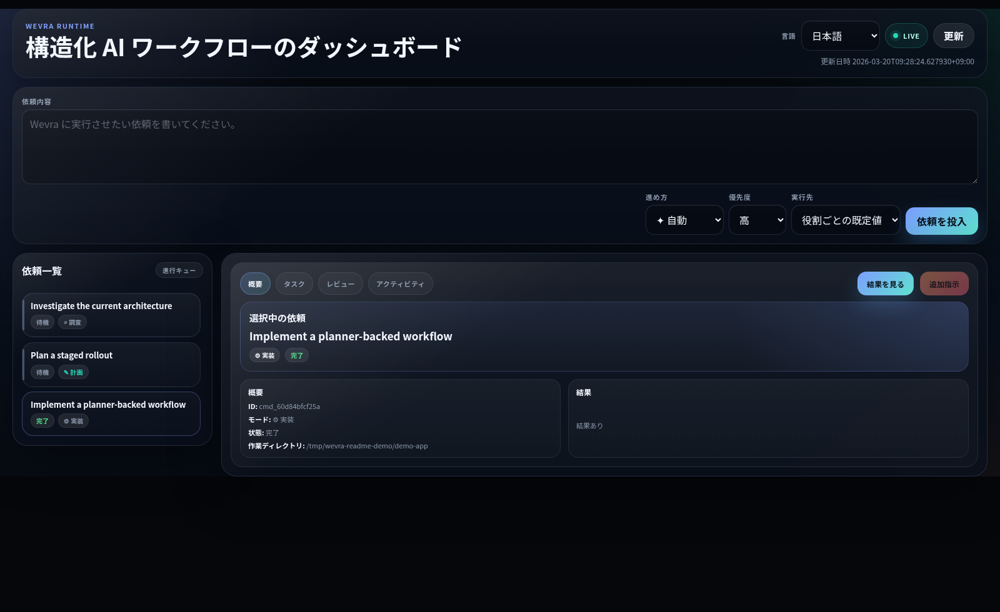

# Wevra

Wevra は、構造化された AI 作業をローカルで回す workflow engine です。

依頼を受け取り、必要な作業に分解し、適切な mode で進め、ユーザー確認が必要なときは止まり、長寿命の AI チャットに依存せずに engine 側でフローを管理します。
1 度依頼を出せば、計画、実装、テスト、最終レビューまで一貫して進められます。

Wevra では、依頼を次の mode で回せます。

| Mode | どういうときに使うか |
| --- | --- |
| `auto` | 依頼に合わせて Wevra に進め方を選ばせたいとき |
| `implementation` | 実装、修正、機能追加を進めたいとき |
| `research` | 調査、比較、分析をして結論をまとめたいとき |
| `review` | 現在の workspace や変更内容をレビューしたいとき |
| `planning` | 実装前に進め方やタスク分解だけを固めたいとき |



## 初回セットアップ

ローカル checkout 直後の初回セットアップ:

```bash
python3 -m venv .venv
./.venv/bin/pip install -e '.[dev]'
./wevra init
```

`wevra init` を実行すると、`wevra.ini`、`agents.ini`、`.env` などのローカル設定ファイルが作られます。

SQLite を別途インストールする必要はありません。

## 設定を調整する

`./wevra init` のあと、必要に応じて生成されたローカル設定ファイルを編集します。

- `wevra.ini`: workspace、dashboard の host と port、通知、runtime の既定値、CLI 用の `HOME` 上書き
- `agents.ini`: role ごとの実行先と model
- `.env`: `DISCORD_WEBHOOK_URL` のようなローカル secret

既定値のままで問題なければ、この手順は飛ばしてそのまま起動できます。

## Quick Start

初回セットアップ後は、通常これだけで始められます。

```bash
./wevra start
```

その後、`http://127.0.0.1:43861` を開いて dashboard から依頼を投入します。

## Dashboard

Wevra は dashboard を中心に使う想定です。

dashboard では次の操作ができます。

- 新しい依頼を投入する
- 進行状況をリアルタイムで見る
- 質問が来たときに回答する
- タスク、レビュー、最終結果を確認する
- 進行中の依頼に追加指示を送る

CLI からも同じ操作ができるので、スクリプト化や自動化にも向いています。

## CLI Examples

実装依頼を流す例:

```bash
./wevra submit --mode implementation "Implement a planner-backed workflow"
./wevra run
```

調査依頼を流す例:

```bash
./wevra submit --mode research "現在の構成を調べてトレードオフを整理する"
./wevra run
```

質問に回答する例:

```bash
./wevra questions --open-only
./wevra answer <question-id> "Proceed with the existing interface."
./wevra run
```

進行中の依頼に追加指示を入れる例:

```bash
./wevra append <command-id> "Keep the current work, but also add a final follow-up pass."
./wevra run --command-id <command-id>
```

## 実行フロー

1. CLI か dashboard から依頼を投入します。
2. Wevra が mode に応じて必要な作業へ分解します。
3. 実行できる作業から順に進め、安全なものは並列に進めます。
4. 確認が必要になったら質問して止まります。
5. `implementation` mode では、実装後に既存テストと最終レビューを行います。
6. 最終レビューが通ったときだけ完了します。

CLI から dashboard を操作する例:

```bash
./wevra dashboard start
./wevra dashboard status
./wevra dashboard stop
```

## 設定リファレンス

`wevra init` を実行すると、次のローカル設定ファイルが作られます。

- `wevra.ini`
- `agents.ini`
- `.env`

### `wevra.ini`

runtime、UI、通知まわりの挙動を設定します。

| キー | 既定値 | 内容 |
| --- | --- | --- |
| `runtime.working_dir` | `.` | 実行対象の workspace ルートです。 |
| `runtime.db_path` | `.wevra/wevra.db` | SQLite DB の保存先です。 |
| `runtime.language` | `en` | runtime の既定言語です。 |
| `runtime.dangerously_bypass_approvals_and_sandbox` | `false` | 必要時に危険な bypass 挙動を許可します。 |
| `runtime.home` | 空 | Codex や Claude など外部 CLI を起動するときに使う `HOME` の上書きです。 |
| `ui.auto_start` | `true` | `wevra start` 実行時に dashboard を自動起動します。 |
| `ui.host` | `127.0.0.1` | dashboard の bind host です。 |
| `ui.port` | `43861` | dashboard の port です。 |
| `ui.open_browser` | `true` | dashboard 起動時にブラウザを開きます。 |
| `ui.language` | 空 | dashboard の言語を明示指定できます。 |
| `notification.question_opened` | `false` | 新しい質問が開いたときの通知フックです。 |
| `notification.workflow_completed` | `false` | workflow 完了時の通知フックです。 |
| `discord.enable` | `false` | Discord 通知を有効化します。 |
| `discord.webhook_url` | `DISCORD_WEBHOOK_URL` | `.env` または実行中の環境変数から読むキー名です。 |

### `agents.ini`

role ごとに、どの実行先と model を使うかを設定します。

- `runtime`: その role をどの実行先で動かすか
- `model`: その実行先に渡す model 名
- `count`: その role を同時にいくつ動かすか

| セクション | キー | 内容 |
| --- | --- | --- |
| `coordinator` | `runtime`, `model` | 依頼の受付や進行調整で使う実行先と model です。 |
| `planner` | `runtime`, `model` | 依頼を作業に分けるときに使う実行先と model です。 |
| `investigation` | `runtime`, `model` | 調査タスクで使う実行先と model です。 |
| `analyst` | `runtime`, `model` | 分析や整理で使う実行先と model です。 |
| `tester` | `runtime`, `model` | テスト工程で使う実行先と model です。 |
| `implementer` | `runtime`, `model`, `count` | 実装工程で使う実行先、model、並列数です。 |
| `reviewer` | `runtime`, `model`, `count` | 最終レビューで使う実行先、model、並列数です。 |

`runtime` に指定できる値は `mock`、`codex`、`claude` です。

`mock` は、デモ、ローカル開発、CI、フロー確認のための擬似実行先です。Codex や Claude を使った実際の実装やレビューは行いません。実運用するときは、`planner`、`implementer`、`reviewer` などを `codex` か `claude` に切り替えてから使ってください。

### `.env`

設定ファイルから参照されるローカル secret や env 値を置きます。

| キー | 参照元 | 内容 |
| --- | --- | --- |
| `DISCORD_WEBHOOK_URL` | `wevra.ini` → `discord.webhook_url` | Discord 通知を有効にしたときに使う実際の webhook URL です。 |

## Development

```bash
./.venv/bin/pytest -q
```

dashboard の UI を変更したときは、PR を出す前に `docs/images/dashboard-en.png` と `docs/images/dashboard-ja.png` も更新してください。
