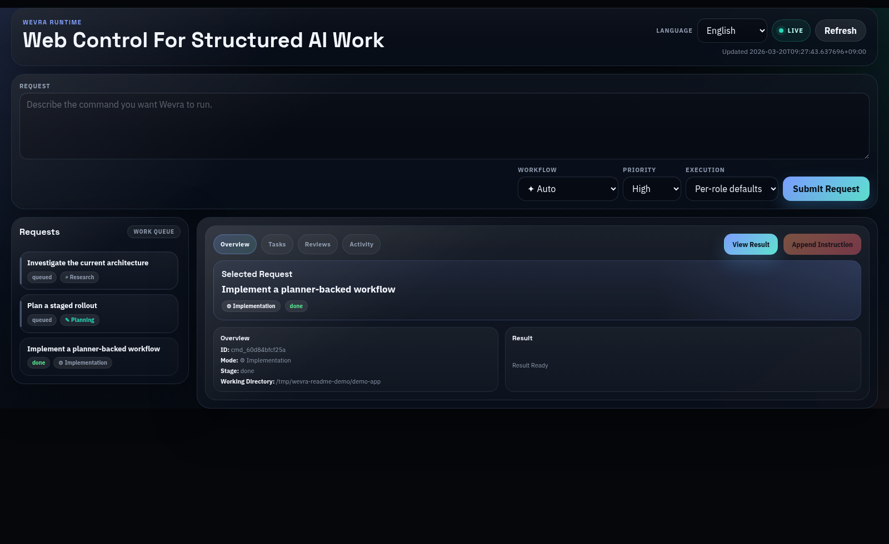

# Wevra

[日本語](README.ja.md)

Wevra is a local workflow engine for structured AI work.

It takes a request, breaks it into tracked steps, runs the work through the right mode, pauses when user input is needed, and keeps the flow inside the engine instead of inside a long-lived AI chat.
With a single request, Wevra can carry work from planning and implementation through tests and final review.

Wevra can run a request in these modes:

| Mode | Use it for |
| --- | --- |
| `auto` | Let Wevra choose the best workflow for the request. |
| `implementation` | Build, change, or fix something with tests and final review. |
| `research` | Investigate, compare, and return a written conclusion. |
| `review` | Inspect the current workspace or changes and return findings. |
| `planning` | Produce a plan or task breakdown without carrying the work through implementation. |



## Initial Setup

First-time setup for a local checkout:

```bash
python3 -m venv .venv
./.venv/bin/pip install -e '.[dev]'
./wevra init
```

`wevra init` creates local config files such as `wevra.ini`, `agents.ini`, and `.env`.

No separate SQLite install is required.

## Configure Wevra

After `./wevra init`, adjust the generated local config files as needed:

- `wevra.ini`: working directory, dashboard host and port, notifications, runtime defaults, and an optional CLI `HOME` override
- `agents.ini`: which runtime and model each role should use
- `.env`: local secrets such as `DISCORD_WEBHOOK_URL`

If the defaults already fit your environment, you can skip this step and start Wevra immediately.

## Quick Start

After the initial setup, start Wevra like this:

```bash
./wevra start
```

Then open the local dashboard at `http://127.0.0.1:43861` and submit a request.

## Dashboard

The dashboard is the default way to use Wevra.

From the dashboard you can:

- submit a new request
- watch progress in real time
- answer questions when the flow pauses
- inspect tasks, reviews, and final results
- append follow-up instructions to active work

Everything in the dashboard can also be driven from the CLI when you want to script or automate it.

## CLI Examples

Run an implementation request:

```bash
./wevra submit --mode implementation "Implement a planner-backed workflow"
./wevra run
```

Run a research request:

```bash
./wevra submit --mode research "Investigate the current architecture and summarize the tradeoffs"
./wevra run
```

Answer a question:

```bash
./wevra questions --open-only
./wevra answer <question-id> "Proceed with the existing interface."
./wevra run
```

Append an instruction to an active request:

```bash
./wevra append <command-id> "Keep the current work, but also add a final follow-up pass."
./wevra run --command-id <command-id>
```

## How It Works

1. Submit a request from the CLI or the dashboard.
2. Wevra breaks the request into the work needed for the selected mode.
3. Work runs in order, with safe parallel execution where possible.
4. If clarification is needed, Wevra pauses and asks the user.
5. In `implementation` mode, Wevra runs the existing test suite and then the final review pass.
6. Work is only complete when the final review passes.

You can also manage the dashboard from the CLI:

```bash
./wevra dashboard start
./wevra dashboard status
./wevra dashboard stop
```

## Configuration Reference

`wevra init` creates these local files:

- `wevra.ini`
- `agents.ini`
- `.env`

### `wevra.ini`

Controls runtime, UI, and notification behavior.

| Key | Default | Purpose |
| --- | --- | --- |
| `runtime.working_dir` | `.` | Workspace root used for execution. |
| `runtime.db_path` | `.wevra/wevra.db` | SQLite database path. |
| `runtime.language` | `en` | Default language for the runtime. |
| `runtime.dangerously_bypass_approvals_and_sandbox` | `false` | Enables unsafe bypass behavior when explicitly needed. |
| `runtime.home` | empty | Optional `HOME` override used when launching external CLIs such as Codex or Claude. |
| `ui.auto_start` | `true` | Starts the dashboard when `wevra start` runs. |
| `ui.host` | `127.0.0.1` | Dashboard bind host. |
| `ui.port` | `43861` | Dashboard port. |
| `ui.open_browser` | `true` | Opens the browser on dashboard start. |
| `ui.language` | empty | Optional dashboard language override. |
| `notification.question_opened` | `false` | Notification hook for newly opened questions. |
| `notification.workflow_completed` | `false` | Notification hook for completed workflows. |
| `discord.enable` | `false` | Enables Discord notifications. |
| `discord.webhook_url` | `DISCORD_WEBHOOK_URL` | Name of the env key to read from `.env` or the current process environment. |

### `agents.ini`

Controls which runtime and model each role uses.

- `runtime`: which execution target to use for that role
- `model`: which model name to pass to that runtime
- `count`: how many workers to run in parallel for that role

| Section | Keys | Purpose |
| --- | --- | --- |
| `coordinator` | `runtime`, `model` | Runtime and model for request intake and flow coordination. |
| `planner` | `runtime`, `model` | Runtime and model for breaking a request into work. |
| `investigation` | `runtime`, `model` | Runtime and model for research tasks. |
| `analyst` | `runtime`, `model` | Runtime and model for analysis and synthesis tasks. |
| `tester` | `runtime`, `model` | Runtime and model for running the test pass. |
| `implementer` | `runtime`, `model`, `count` | Runtime, model, and parallel worker count for implementation work. |
| `reviewer` | `runtime`, `model`, `count` | Runtime, model, and parallel reviewer count for final review. |

Supported `runtime` values are `mock`, `codex`, and `claude`.

`mock` is for demos, local development, CI, and flow verification. It does not perform real implementation or review work through Codex or Claude. Before using Wevra for real work, switch roles such as `planner`, `implementer`, and `reviewer` to `codex` or `claude`.

### `.env`

Stores local secrets and env values referenced by the config files.

| Key | Used By | Purpose |
| --- | --- | --- |
| `DISCORD_WEBHOOK_URL` | `wevra.ini` → `discord.webhook_url` | Actual Discord webhook URL when Discord notifications are enabled. |

## Development

```bash
./.venv/bin/pytest -q
```

If you change the dashboard UI, refresh `docs/images/dashboard-en.png` and `docs/images/dashboard-ja.png` before opening a PR.
