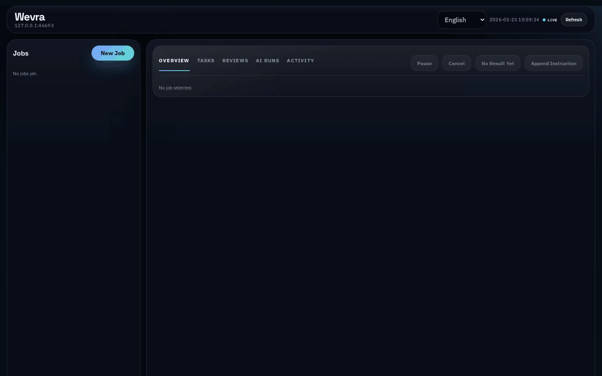

# Wevra

[日本語](README.ja.md)

Wevra is an orchestration engine for AI jobs.

With a single job, Wevra can carry work from planning and implementation through tests and final review.

Wevra can run a job in these execution modes:

| Mode | Description |
| --- | --- |
| `auto` | Resolves the job into the most suitable mode before execution begins. Ambiguous requests fall back to `implementation`. |
| `implementation` | Breaks the work into tracked tasks, runs implementation, executes the existing test suite, and finishes with final review. |
| `research` | Runs investigation and analysis work, then returns a written markdown result without entering implementation, test, or final review gates. |
| `review` | Collects the necessary context for review work and carries the job through the final reviewer pass. |
| `planning` | Produces a structured planning result with separate plan, design direction, and task breakdown sections without moving into implementation. |



## Initial Setup

First-time setup for a local checkout:

```bash
python3 -m venv .venv
./.venv/bin/pip install -e '.[dev]'
./wevra init
```

`wevra init` creates local config files such as `wevra.ini`, `agents.ini`, and `.env`.

## Configure Wevra

After `./wevra init`, adjust the generated local config files if needed:

- `wevra.ini`: dashboard port, notifications, runtime defaults, and an optional CLI `HOME` override
- `agents.ini`: which runtime and model each role should use
- `.env`: local secrets such as `DISCORD_WEBHOOK_URL`

## Quick Start

After the initial setup:

```bash
./wevra start
```

Then open the local dashboard at `http://127.0.0.1:43861` and create a job.

## Dashboard

From the dashboard you can:

- start a new job and choose its execution mode, approval style, AI, working directory, and optional dependencies
- watch progress, tasks, reviews, live agent logs, and results in real time
- answer questions, approve or deny agent actions, and recover interrupted AI runs
- pause a running job at a safe boundary and resume it later
- run independent jobs in parallel when their workspaces do not overlap
- append follow-up instructions to active work
- open structured result sections in the dashboard and download the current section as `.md`

## CLI Examples

The same actions are available from the CLI when you want to script or automate them.

Run an implementation job:

```bash
./wevra submit --mode implementation --workspace-dir /path/to/worktree "Implement a planner-backed workflow"
./wevra run
```

Run a research job:

```bash
./wevra submit --mode research --workspace-dir /path/to/worktree "Investigate the current architecture and summarize the tradeoffs"
./wevra run
```

Answer a question:

```bash
./wevra questions --open-only
./wevra answer <question-id> "Proceed with the existing interface."
./wevra run
```

Append an instruction to an active job:

```bash
./wevra append <command-id> "Keep the current work, but also add a final follow-up pass."
./wevra run --command-id <command-id>
```

Inspect or resolve pending agent approvals from the CLI:

```bash
./wevra submit --mode implementation --approval-mode manual --workspace-dir /path/to/worktree "Implement a planner-backed workflow"
./wevra run --command-id <command-id>
./wevra agent-runs --command-id <command-id>
./wevra approve-agent-run <agent-run-id>
./wevra approve-agent-runs <command-id> --role implementer
./wevra deny-agent-run <agent-run-id> "Do not run external tools for this job."
```

Retry or repair an interrupted AI run:

```bash
./wevra retry-operator-issue <command-id>
./wevra retry-operator-issue <command-id> --backend claude
./wevra cancel-with-repair <command-id> "Restore changes left by interrupted job: planner rollout"
```

## How It Works

1. Create a job from the CLI or the dashboard.
2. Set a working directory, and add job dependencies when work must wait for earlier jobs to finish.
3. Wevra breaks the job into the work needed for the selected mode.
4. Top-level jobs stay serial by default. Independent jobs can opt into safe parallel execution when their workspaces do not overlap.
5. If clarification is needed, Wevra pauses and asks the user.
6. If agent actions require operator approval, Wevra pauses and waits in the `Agents` tab until each run is allowed or denied.
   You can also approve the whole job, or a whole role such as `implementer`, in one action.
7. If a dependency fails, the blocked job stays out of execution until you ignore the dependency or cancel the job from the overview.
8. In `implementation` mode, Wevra runs the existing test suite and then the final review pass.
9. Work is only complete when the final review passes.

You can also manage the dashboard from the CLI:

```bash
./wevra dashboard start
./wevra dashboard status
./wevra dashboard stop
```

## Configuration Reference

`wevra init` creates these local files:

- `wevra.ini`
- `agents.ini`
- `.env`

### `wevra.ini`

Controls runtime, UI, and notification behavior.

| Key | Default | Purpose |
| --- | --- | --- |
| `runtime.db_path` | `.wevra/wevra.db` | SQLite database path. |
| `runtime.language` | `en` | Default language for the runtime. |
| `runtime.agent_timeout_seconds` | `1800` | Maximum time to wait for a Codex or Claude structured response before failing the run. |
| `runtime.home` | empty | Optional `HOME` override used when launching external CLIs such as Codex or Claude. |
| `ui.auto_start` | `true` | Starts the dashboard when `wevra start` runs. |
| `ui.port` | `43861` | Dashboard port. |
| `ui.open_browser` | `true` | Opens the browser on dashboard start. |
| `ui.language` | empty | Optional dashboard language override. |
| `notification.question_opened` | `false` | Notification hook for newly opened questions. |
| `notification.workflow_completed` | `false` | Notification hook for completed workflows. |
| `discord.enable` | `false` | Enables Discord notifications. |
| `discord.webhook_url` | `DISCORD_WEBHOOK_URL` | Name of the env key to read from `.env` or the current process environment. |

### `agents.ini`

Controls which runtime and model each role uses.

- `runtime`: which execution target to use for that role
- `model`: which model name to pass to that runtime
- `count`: how many workers to run in parallel for that role

| Section | Keys | Purpose |
| --- | --- | --- |
| `coordinator` | `runtime`, `model` | Runtime and model for job intake and flow coordination. |
| `planner` | `runtime`, `model` | Runtime and model for breaking a job into work. |
| `investigation` | `runtime`, `model` | Runtime and model for research tasks. |
| `analyst` | `runtime`, `model` | Runtime and model for analysis and synthesis tasks. |
| `tester` | `runtime`, `model` | Runtime and model for running the test pass. |
| `implementer` | `runtime`, `model`, `count` | Runtime, model, and parallel worker count for implementation work. |
| `reviewer` | `runtime`, `model`, `count` | Runtime, model, and parallel reviewer count for final review. |

Supported `runtime` values are `mock`, `codex`, and `claude`.

`mock` is for demos, local development, CI, and flow verification. It does not perform real implementation or review work through Codex or Claude. Before using Wevra for real work, switch roles such as `planner`, `implementer`, and `reviewer` to `codex` or `claude`.

Approval is chosen per job from the dashboard or CLI. Use `auto` when you want Codex or Claude runs to proceed without an operator step, or `manual` when you want Wevra to pause in the `Agents` tab and wait for allow or deny decisions.

### `.env`

Stores local secrets and env values referenced by the config files.

| Key | Used By | Purpose |
| --- | --- | --- |
| `DISCORD_WEBHOOK_URL` | `wevra.ini` → `discord.webhook_url` | Actual Discord webhook URL when Discord notifications are enabled. |

## Development

```bash
./.venv/bin/pytest -q
```

If you change the dashboard UI, refresh `docs/images/dashboard-flow-en-live.gif` and `docs/images/dashboard-flow-ja-live.gif` before opening a PR.
